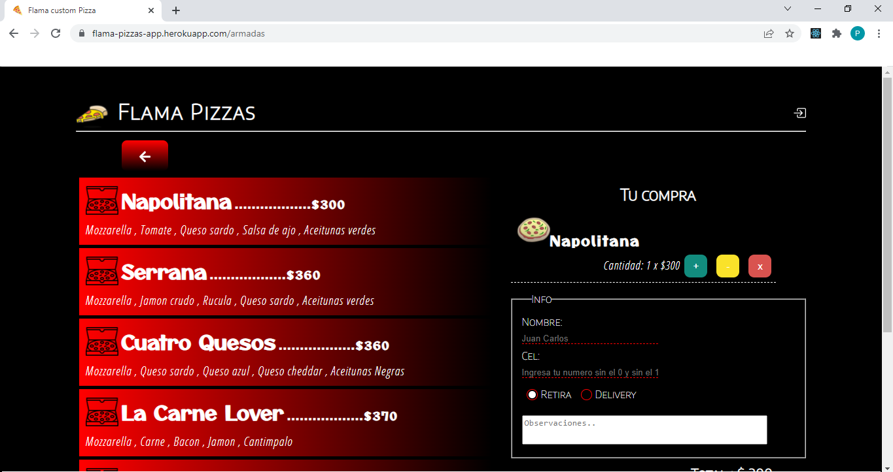

<b>Hi there, I'm Pablo Muzio </b> 👋

<b>I'm glad to have you here!</b>

About me:

💻 I am an accountant and web developer oriented to the front end. 
:yellow_heart: I love make applications that are useful, that add value and make our lives easier.

     <b
      ><g-emoji
        class="g-emoji"
        alias="hammer_and_wrench"
        fallback-src="https://github.githubassets.com/images/icons/emoji/unicode/1f6e0.png"
        >🛠️</g-emoji
      >&nbsp;&nbsp;Languages&nbsp;and&nbsp;Tools</b
    >
    

   
  
      CONST HARDSKILLS = [JavaScript, React, Svelte, Sveltekit, HTML5, CSS, Bootstrap, Git, Github];
      
:nerd_face: <b>Soft Skills:</b>
       
      <ul>
            <li>Team player</li>
            <li>Atention to details</li>
            <li>Proactive</li>
      </ul>

 <b>Contact me:</b>
   
 <a href="https://wa.me/5493512003309?text=Hola%20Pablo,%20te%20contacto%20porque%20vi%20tu%20portafolio%20en%20Internet!" rel="nofollow">
      
       Leave me a message!
    </a> 
  
:envelope: pablo_89_cba@hotmail.com 
  
<a href="https://www.linkedin.com/in/pablo-alejandro-muzio-49a57153/" rel="nofollow" target="_blank">LinkedIn</a>

:office_worker:<b>My last Project / Works</b>
  
<b>Park Now - App to search for a parking lot in the city of Córdoba, Argentina.</b>
  
Application created with React and Redux, which allows you to search for nearby parking lots based on a destination entered by the user. 
I worked with the google API, the Socket.io library and for the back-end we used both PHP and Node.js. 
By entering the address Blamey Lafore 1463, you can see garages loaded as a test.
  

  
https://parking-now.netlify.app/logIn
  
<b>Flama Pizza</b>
  
Flama Pizzas, is a place for the sale of personalized pizzas, assembled by customers.
The App aims to provide clients with a digital interface, where they can place their order faster.
It generates a ticket in which the order is detailed, it has a private section, where the owners can create or delete pizzas and/or toppings.
  

  
https://flamapizzas.onrender.com/

<!-- :telephone_receiver: +54 9 3512 003 309 -->
